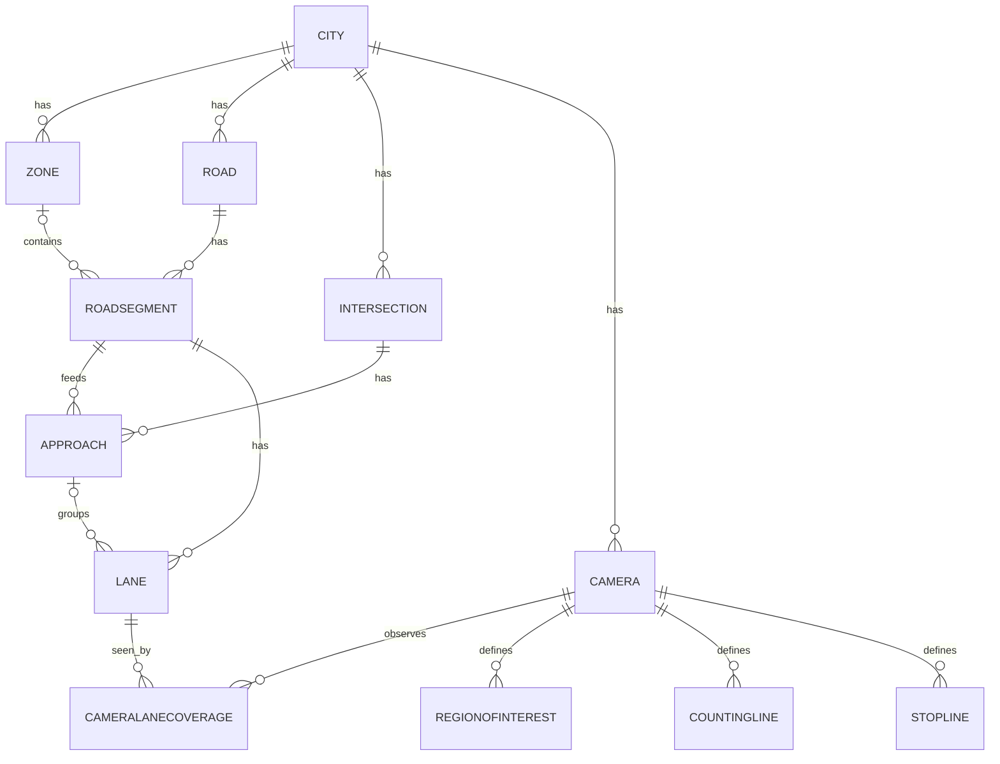

# PHASE 3 — TRAFFIC NETWORK MODEL — IMPLEMENTATION PLAN

**Project:** AI Traffic Intelligence & Management Platform
**Phase:** 3 — Traffic Network Configuration (domain foundation)
**Depends on:** Phase 0 (frozen), Phase 1 & Phase 2 (COMPLETE)
**Status:** READY FOR REVIEW — planning only; no code, migrations, deps, or edits to existing files.

---

## 1. Current State Verified

Inspected the live repository (not just reports).

**Apps (8):** `common`, `accounts`, `health`, `realtime`, `audit`, `governance`, `retention`, `observability`.
**Migrations (8):** accounts (0001 initial, 0002 seed_roles), audit (0001 initial, 0002 immutability_trigger), governance (0001), observability (0001), retention (0001, 0002 seed_policies).
**Models:** accounts(User, Role); audit(AuditEvent, immutable, actor by value); governance(AIModel, AIModelVersion, ModelArtifact, ModelEvaluation, AlgorithmDefinition, AlgorithmVersion, StoredArtifact); retention(RetentionPolicy, RetentionRun); observability(SystemMetric); common(abstract UUIDModel/TimeStampedModel/UUIDTimeStampedModel). **No traffic-domain models exist** — Phase 3 is greenfield here.
**Schemas:** `public`, `config`, `operational`, `analytical`, `ai` all exist; `config`/`operational`/`analytical`/`ai` owned by `aitraffic_app`, currently **empty** (reserved).
**DB role:** runtime = `aitraffic_app` (non-superuser, non-createrole, dev-only createdb).
**Tests:** **122 passed, 0 failed, 0 skipped** (re-run now); ruff clean.
**ADRs (9):** 001, 002, 011, 013, 014, 015, 016, 017, 018. Next id = **019**.
**PostGIS:** **NOT available** on this PG18 (`pg_available_extensions` has no `postgis`). Adopting it requires installing PostGIS + GEOS/GDAL/PROJ and GeoDjango — significant Windows setup. (Directly informs D2.)

**Phase 2 foundations available for reuse:** audit service (`record_audit`), RBAC permission classes (`IsSystemAdmin`, `IsAdminRole`, `HasAnyRole`), envelope renderer + `StandardPagination`, `DataCategory` vocabulary, metrics collectors (`incr`/`observe`), retention registry, `UUIDTimeStampedModel` base.

**Discrepancies found (reported, not silently touched):**
1. **Minor (Phase 2 frontend):** during the browser test the `/admin/observability` page rendered its header but the summary cards did not appear, while `/api/v1/observability/summary` returns 200. Audit, Retention (interactive dry-run → 200), and Registry pages rendered live data correctly. Likely a client state/first-render timing nuance (summary object mapping), not a backend defect. **Flagged for a small Phase 3 frontend fix**; not a functional blocker and not modified during planning.
2. No other discrepancies; documentation matches implementation.

---

## 2. Phase 3 Objectives

Implement the **configuration/domain model of a real traffic network** (City→Zone→Road→RoadSegment→Intersection→Approach→Lane) plus Camera assets, camera→network coverage, and image-space configuration (RegionOfInterest, CountingLine, StopLine) — as validated, audited, permission-controlled CRUD. Establish coordinate-space vocabulary and a versioning hook so future processing results are reproducible. **Configuration only.**

---

## 3. Explicit Non-Goals (Phase 3)

No video upload/storage/RTSP/decoding; no CV runtime/GPU; no detection/tracking/counting/speed/queue/congestion/incident; no prediction; no SUMO; no traffic signals/optimization; no digital twin; no Operations Center; no live camera; no live traffic display; **no counting/queue logic** (image-space entities store *configuration* only); no routing algorithms; no graph database.

---

## 4. Schema Strategy Analysis (D1)

Django 5.2 has **no first-class per-model schema support**. Placing tables in `config` requires one of:
- `db_table = 'config"."city'` (embedded-quote hack) — works but is fragile across introspection, `dumpdata`, some third-party tools, and is easy to typo;
- a connection `search_path` set to `config,public` — then unqualified tables land in `config`, but Django's migration/introspection and the existing `public` tables (accounts, audit, …) require `public` to remain reachable, and **cross-schema FKs** (e.g., audit references by value already; but future FKs from `public` apps to `config` tables) add mental overhead;
- test DB creation must recreate the `config` schema (extra `migrate`/`run_syncdb` setup), and `aitraffic_app` must own it (it does).

**Benefits of `config` now:** only *logical* tidiness. There is **no PostGIS** (so no spatial-schema benefit), no separate backup/tablespace/permission requirement at laptop scale, and domain separation is already achieved by app + `db_table` naming (`network_city`, etc.).

**Costs of `config` now:** real migration/quoting/test complexity and third-party-compat risk for zero measured benefit.

## 5. Recommended Schema Decision (D1 → Option A, `public`)

**Continue using `public`** for Phase 3 (consistent with ADR-013/015; those are not modified). Realize domain separation via the `network` app + `network_*` table prefix. **Reconsideration trigger (documented in ADR-019):** move network tables to `config` only when at least one of these becomes true — (a) a second physical database or separate operational/analytical storage is introduced; (b) schema-level backup/permission isolation is required; (c) PostGIS is adopted and a spatial schema is warranted; (d) table count/ops make schema grouping genuinely valuable. **ADR-019** records this with the exact future-migration path (rename tables into `config` via `ALTER TABLE … SET SCHEMA` — a metadata-only operation — plus a `search_path`/`db_table` update).

---

## 6. Geospatial Strategy Analysis (D2)

- **Option A — Plain PostgreSQL:** store lat/lng as `Decimal` and polylines/polygons as validated `JSONField` (GeoJSON-compatible coordinate arrays), coordinate-space tagged. No extra deps. Point-in-polygon/distance done in Python where rarely needed in Phase 3 (config has no heavy spatial queries yet).
- **Option B — PostGIS/GeoDjango:** native `geometry`/`geography`, spatial indexes, rich queries — but **not installed** here; requires PostGIS + GEOS/GDAL/PROJ + GeoDjango on Windows (heavy, brittle), and `aitraffic_app`/superuser must `CREATE EXTENSION postgis`. Phase 3 has no query that needs it yet (spatial querying starts mattering at digital-twin/simulation/routing phases).

## 7. Recommended Geospatial Decision (D2 → Option A now, PostGIS-ready)

**Plain PostgreSQL** with structured, coordinate-space-tagged geometry stored so a later PostGIS migration is mechanical:
- Points → `Decimal(9,6)` lat/lng (WGS84) fields.
- Lines/polygons → `JSONField` holding `{"space": "...", "coordinates": [[x,y], …]}` in **GeoJSON coordinate order** so a future migration can `ST_GeomFromGeoJSON`.
- A `GeometryValidator` enforces structure now.
**ADR-020** records this, the future PostGIS trigger (when spatial queries/spatial indexing/large-network point-in-polygon become hot — expected around simulation/digital-twin), and the migration approach.

---

## 8. Coordinate-System Strategy

Three explicitly separated spaces; every geometry declares its space and they are **never mixed**:
- **GEO (WGS84 lat/lng)** — City center, Zone/Road/Segment/Intersection/Camera locations, Lane/Segment real-world geometry. Range-validated (lat ∈ [-90,90], lng ∈ [-180,180]).
- **IMAGE (normalized 0.0–1.0)** — RegionOfInterest polygons, CountingLine, StopLine, in camera-frame space. **Normalized is canonical** (survives resolution changes); pixel coords are never the stored form (a helper can convert to pixels given a resolution at read time). Range-validated [0,1].
- **WORLD/LOCAL (future calibration/homography)** — vocabulary + a `coordinate_space` enum value reserved only. **No calibration implemented in Phase 3.**

A shared `CoordinateSpace` TextChoices (`geo`, `image_normalized`, `world`) lives in `common`.

---

## 9. Configuration-Versioning Strategy (D3)

Requirement: a future `ProcessingSession` must reference the exact camera/network config used, without event-sourcing.

**Recommended: Option B-lite — mutable config + monotonic `revision` + `config_hash`** on geometry/config-bearing entities (Camera, Lane, RegionOfInterest, CountingLine, StopLine):
- `revision` (PositiveInt, starts 1) auto-increments when versioned fields change.
- `config_hash` = sha256 of the canonical serialization of versioned fields (reuse the Phase 2 `canonical_config_hash` helper pattern).
- Future `ProcessingSession` (Phase 5) will store `(camera_id, camera_config_hash, per-entity revision set)` at session start; an optional immutable `CameraConfigSnapshot` table can be added **later** if full point-in-time reconstruction is needed.
This gives reproducibility/traceability now with minimal machinery. **ADR-021** documents it and explicitly defers snapshots. (Not full Option C; not bare Option A.)

---

## 10. Complete Domain Model

All in a new `network` app, inheriting `UUIDTimeStampedModel`, `is_active` where noted, in `public` (ADR-019).

- **City** — `name`, `code` (unique), `country_code`, `timezone`, `center_lat/lng`, `boundary` (JSON polygon, geo, optional), `is_active`, `metadata` (JSON, size-capped, purpose-scoped).
- **Zone** — `city` (FK PROTECT), `name`, `code` (unique per city), `boundary` (JSON geo, optional), `is_active`. Zones **may overlap** (no partition constraint) — documented.
- **Road** — `city` (FK PROTECT), `name`, `code` (unique per city), `road_type` (enum), `directionality` (enum), `is_active`. Road belongs to **City** (not a single Zone); zone association is at **segment** level (a road crosses zones).
- **RoadSegment** — `road` (FK PROTECT), `zone` (FK SET_NULL, optional), `start_lat/lng`, `end_lat/lng`, `geometry` (JSON geo polyline, optional), `length_m` (Decimal), `length_source` (`manual`/`derived`), `direction` (enum), `speed_limit_kph`, `lane_count`, `is_active`. Length supports both manual and derived-from-geometry with provenance; no accuracy claimed beyond coordinate precision.
- **Intersection** — `city` (FK PROTECT), `zone` (FK SET_NULL, optional), `name`, `code` (unique per city), `location_lat/lng`, `intersection_type` (enum), `is_active`. Segments are **not** forced to terminate at intersections.
- **Approach** — `intersection` (FK PROTECT), `road_segment` (FK PROTECT), `direction` (enum), `bearing_deg` (0–359), `approach_type` (`incoming`/`outgoing`/`bidirectional`). Supports future signal phases + queue measurement.
- **Lane** — `road_segment` (FK PROTECT), `approach` (FK SET_NULL, optional), `lane_index` (int), `direction` (enum), `lane_type` (controlled vocab: general, bus, bicycle, emergency, turn, parking, shoulder), `geometry` (JSON geo polyline, optional), `width_m`, `speed_limit_override_kph` (optional), `revision`, `config_hash`, `is_active`.
- **Camera** — `city` (FK PROTECT), `intersection` (FK SET_NULL, optional), `zone` (FK SET_NULL, optional), `name`, `code` (unique per city), `location_lat/lng`, `bearing_deg`, `camera_type` (enum), `source_type` (enum placeholder — **no credentials**), `install_metadata` (JSON, capped), `revision`, `config_hash`, `is_active`. **No credentials/URLs stored** (deferred to the secure video-source phase).
- **CameraLaneCoverage** (through model, Camera M:N Lane) — `camera` (FK), `lane` (FK), `coverage_type` (enum: primary/secondary/partial), `priority` (int), `is_active`. Unique `(camera, lane)`. Camera↔segment/intersection are **derived** from lane coverage (not redundantly stored) to avoid inconsistency.
- **RegionOfInterest** — `camera` (FK PROTECT), `name`, `roi_type` (enum: detection/ignore/incident/lane_area), `polygon` (JSON, image_normalized), `lane` (FK SET_NULL optional), `revision`, `config_hash`, `is_active`. Unique `(camera, name)`.
- **CountingLine** — `camera` (FK PROTECT), `lane` (FK SET_NULL optional), `name`, `start` `{x,y}` + `end` `{x,y}` (image_normalized), `counting_direction` (enum), `revision`, `config_hash`, `is_active`. Unique `(camera, name)`.
- **StopLine** — `camera` (FK PROTECT), `approach` (FK SET_NULL optional), `lane` (FK SET_NULL optional), `name`, `line` (JSON, image_normalized, 2 points), `revision`, `config_hash`, `is_active`. Unique `(camera, name)`.

## 11. Entity Relationships

- City 1─N Zone; City 1─N Road; City 1─N Intersection; City 1─N Camera.
- Road 1─N RoadSegment; RoadSegment N─1 Zone (optional).
- Intersection 1─N Approach; Approach N─1 RoadSegment.
- RoadSegment 1─N Lane; Lane N─1 Approach (optional).
- Camera N─M Lane via CameraLaneCoverage.
- Camera 1─N {RegionOfInterest, CountingLine, StopLine}; those optionally reference Lane/Approach.

## 12. Cardinality Diagram (Mermaid)

## 13. Database Constraints

- Unique: `City.code`; `Zone(city, code)`; `Road(city, code)`; `Intersection(city, code)`; `Camera(city, code)`; `Lane(road_segment, lane_index, direction)`; `CameraLaneCoverage(camera, lane)`; `RegionOfInterest(camera, name)`; `CountingLine(camera, name)`; `StopLine(camera, name)`.
- FKs: `PROTECT` for ownership edges that carry history/config (city→zone/road/intersection/camera, road→segment, segment→lane, camera→image-space) to block destructive deletes; `SET_NULL` for optional cross-links (segment.zone, lane.approach, camera.intersection/zone, image-space.lane/approach).
- Check-style validation (model `clean` + DB check where feasible): lat/lng ranges, bearing 0–359, normalized coords 0–1, `lane_index >= 0`.
Each uniqueness rule is validated against real-network reality (e.g., lane index unique per segment **and** direction, since opposing directions reuse indices).

## 14. Index Strategy

Indexes on all parent FKs (`city_id`, `zone_id`, `road_id`, `road_segment_id`, `intersection_id`, `approach_id`, `camera_id`, `lane_id`), on `is_active`, and on frequently filtered `code`. Composite `(city_id, is_active)` for list endpoints. No spatial indexes (no PostGIS). No speculative indexes beyond expected filter patterns (§16).

## 15. Archive/Deletion Strategy

- **Default DELETE = archive** (`is_active=False`) for topology entities (City…Lane, Camera) to preserve future referential integrity with measurements/sessions/incidents.
- **Hard delete allowed** only for leaf image-space config (ROI/CountingLine/StopLine) with no references, system_admin only.
- `PROTECT` FKs prevent hard-deleting a parent with children → API returns a clear 409/400 with guidance to archive instead.
- No generic soft-delete framework; a simple `is_active` + archive endpoint. Documented what each DELETE does per resource.

## 16. Camera Model
Logical/physical asset only (§10). **No credentials, no RTSP URL, no secrets** — those belong to the later secure video-source phase. `source_type` is a placeholder enum. `config_hash`/`revision` support reproducibility.

## 17. Camera Coverage Model
`CameraLaneCoverage` M:N through (§10) — one camera → many lanes, one lane → many cameras. Camera↔road-segment and camera↔intersection are **derived** from lane coverage, not stored redundantly (avoids drift). Unique `(camera, lane)`; `coverage_type` + `priority` resolve multi-camera overlaps.

## 18. Image-Space Configuration
RegionOfInterest / CountingLine / StopLine store **validated normalized (0–1) geometry** only (§10). No counting/queue logic. Each carries `revision`+`config_hash`.

## 19. Geometry Validation
A `common.geometry` module: validators for lat/lng ranges; normalized-coord ranges; polygon min 3 vertices + closed/renderable; line exactly 2 points, non-degenerate (start≠end); duplicate-point rejection; optional simple self-intersection check for small polygons; coordinate-space match (an image entity rejects geo coords and vice-versa). Canonical storage = one representation per space (normalized for image, decimal lat/lng for geo). Both normalized+pixel are **not** stored; pixels derived on demand.

## 20. Network Graph Future Compatibility
Relationships already suffice to derive a directed graph later: **nodes** = Intersections (+ segment endpoints), **edges** = RoadSegments (with Approaches giving direction/turn structure). No graph DB; PostgreSQL remains system of record. A future adapter can build `networkx`/SUMO graphs from these tables. No routing implemented.

## 21. Audit Integration
A reusable `AuditedModelViewSet` mixin emits `record_audit` (transactional) on create/update/archive/delete for every network entity, with `target_type`/`target_id`, changed **field names**, actor, outcome, request_id. **Geometry is never duplicated in audit metadata** — for geometry/config changes it stores `old_config_hash`/`new_config_hash` + changed field names only. New audit `EventType` values: `network_config_created/updated/archived/deleted` (or per-entity granularity via `target_type`). This extends, not modifies, Phase 2 audit (adding enum members is additive).

## 22. Permission Matrix

| Action | system_admin | traffic_admin | operator | analyst | incident_op | viewer |
|---|:--:|:--:|:--:|:--:|:--:|:--:|
| Read network topology (city…lane, intersection, approach) | ✅ | ✅ | ✅ | ✅ | ✅ | ✅ |
| Read camera **logical asset** + image-space config | ✅ | ✅ | ✅ | ✅ | ✅ | ✅ (no creds exist) |
| Create/Update/Archive topology + camera + coverage + image-space | ✅ | ✅ | ❌ | ❌ | ❌ | ❌ |
| Hard delete leaf image-space config | ✅ | ❌ | ❌ | ❌ | ❌ | ❌ |

Enforced server-side (reuse Phase 1/2 permission classes). Since Phase 3 cameras hold **no credentials**, viewer read is acceptable; when credentials arrive (later phase) they live in a separate secured resource never exposed here. Documented.

## 23. API Contracts (under `/api/v1/network/`, standard envelope, paginated)
`cities`, `zones`, `roads`, `road-segments`, `intersections`, `approaches`, `lanes`, `cameras`, `camera-coverages`, `regions-of-interest`, `counting-lines`, `stop-lines` — each a flat DRF ViewSet (GET list/retrieve, POST, PATCH, DELETE=archive). **Flat routes, not deeply nested** (filtering covers relationships). `DELETE` archives (topology) or hard-deletes (leaf image config, sysadmin). Export: `GET /network/cities/{id}/export` returns the city's network as JSON (D5).

## 24. Filtering Strategy
Query-param filters via DRF: zones `?city=`; roads `?city=`; segments `?road=`,`?zone=`; intersections `?city=`,`?zone=`; approaches `?intersection=`,`?road_segment=`; lanes `?road_segment=`,`?approach=`; cameras `?city=`,`?intersection=`,`?zone=`; coverages `?camera=`,`?lane=`; image-space `?camera=`,`?lane=`. Plus `?is_active=`. No search infrastructure (no full-text/Elastic).

## 25. Bulk Import/Export Decision (D5)
**Ship JSON export only** (`GET …/cities/{id}/export` → nested JSON of the city network). **Defer bulk import** to a later phase (import needs careful pre-commit validation, transactional all-or-nothing, and per-entity audit — build it deliberately, not rushed). When import ships, it must validate fully before commit, be transactional, and emit audit. Documented.

## 26. Frontend Scope
Admin-style config pages under `/admin/network` (system_admin + traffic_admin): Cities, Zones, Roads, Road Segments, Intersections, Lanes, Cameras (list + create/edit forms with **lat/lng numeric inputs** and normalized-coord inputs; validation mirrors backend). Reuse Phase 1/2 `apiFetch`, envelope, auth. **No** digital twin / ops center / live traffic / live cameras.

## 27. Map Strategy (D4)
**Recommend NO map in Phase 3** — numeric lat/lng + optional GeoJSON paste is sufficient for configuration and avoids a dependency + tile-provider concern. If you approve a basic map, **ADR-022** would specify **react-leaflet (BSD) + OpenStreetMap raster tiles (free, attribution + usage policy, internet-dependent in dev)**, cleanly separating **rendering library (Leaflet)** from **tile provider (OSM, swappable/self-hostable later)** — no Mapbox/Google paid dependency. Bundle impact ~40–60 kB gz. Draft ADR-022 only if D4 = yes.

## 28. Retention Integration
Traffic configuration is long-lived reference data → **excluded from automatic retention**. Add a `TRAFFIC_CONFIG` `DataCategory` value for classification/governance, but register **no retention handler** for it (archived config remains available for historical reference). Documented (a destructive network-config retention handler is explicitly not created).

## 29. Observability Integration
Reuse Phase 2 metrics: config API requests already counted by `MetricsMiddleware` (existing `http_requests_total`/latency). Optionally add a bounded counter `network_validation_failures_total` (labels: `entity`) via the existing allowlist mechanism. No business/traffic analytics.

## 30. Data Classification
Add `TRAFFIC_CONFIG` to `DataCategory` (classification only; no table-per-category assumption, no retention handler). No other new categories.

## 31. Repository Changes
New `apps/network/` (models, serializers, views, urls, permissions, filters, geometry validators or reuse `common.geometry`, apps.py, migrations); `common/coordinatespace.py`, `common/geometry.py`; new audit `EventType` members (additive migration-free enum change) — audit metadata unchanged. New frontend `src/app/admin/network/**` + `src/lib/networkApi.ts`. `docs/adr/ADR-019..021(.022).md`. New tests. Additive settings only if needed (e.g., `NETWORK_METADATA_MAX_BYTES`).

## 32. Django App/Module Structure
`apps/network/{__init__,apps,models,serializers,views,urls,permissions,filters}.py`, `apps/network/migrations/`. Models split by concern in one `models.py` (or a `models/` package: `topology.py`, `camera.py`, `imagespace.py`) for readability. `common/geometry.py` (validators) + `common/coordinatespace.py` (enums) reused by serializers/models. `network` depends on `common` + `audit` only (one-way).

## 33. Migrations Expected
One `network/0001_initial` creating all tables + constraints + indexes. Possibly `0002_seed_reference` only if we seed enums/reference rows (likely none — enums are `TextChoices`, no seed needed). Audit `EventType` additions require **no migration** (choices are not DB-enforced enums here). Total expected: **1 migration**.

## 34. ADRs Required
- **ADR-019 — Traffic Configuration Schema Strategy** (D1: `public` now; reconsideration triggers; future `SET SCHEMA` path). Does not modify ADR-013/015.
- **ADR-020 — Geospatial Storage Strategy** (D2: plain PG + GeoJSON-ordered JSON; PostGIS deferral triggers + migration path).
- **ADR-021 — Configuration Versioning Strategy** (D3: revision + config_hash; ProcessingSession reference contract; snapshots deferred).
- **ADR-022 — Local-First Map Strategy** — **only if** D4 = yes (react-leaflet + OSM, provider/library separation, self-host path).

## 35. Testing Strategy
- **Domain:** valid hierarchy create; invalid cross-parent relationships (e.g., lane on segment of another road; approach segment not feeding its intersection's city); uniqueness constraints; archive vs hard-delete behavior; is_active filtering.
- **Geometry:** valid geo lat/lng; out-of-range lat/lng rejected; valid normalized polygon; out-of-range image coords rejected; degenerate line/polygon rejected; coordinate-space mismatch rejected; duplicate-point rejected.
- **API:** CRUD; filtering; pagination; permission matrix (write blocked for non-admins); validation errors; export shape.
- **Audit:** each config change emits the correct event with changed-field-names + config-hash pair and **no full geometry** in metadata (assert payload size / absence of coordinate arrays).
- **Database:** constraint enforcement at DB level (unique, PROTECT) via direct attempts.
- **Versioning:** `revision` increments + `config_hash` changes on geometry edit; unchanged save doesn't bump.
- **Regression:** all **122** existing tests remain green; none removed/weakened.

## 36. Failure/Edge-Case Testing
Parent archived while children active (children remain, links intact); duplicate codes/lane-indexes/coverage rejected; invalid/empty geometry rejected; very large geometry payload rejected (vertex cap); cross-city/cross-road invalid FKs rejected; invalid camera-lane association rejected; deleting referenced config → PROTECT 409/guidance; unauthorized modification → 403; concurrent update (last-write-wins with revision bump; optional optimistic `revision` precondition documented).

## 37. Security Considerations
Server-side RBAC on every endpoint; no camera credentials anywhere in Phase 3; metadata JSON size-capped (DoS guard) and purpose-scoped; geometry vertex-count capped; all writes audited; archive-over-delete preserves integrity; envelope hides internals. All Phase 1/2 security properties preserved.

## 38. Performance Considerations
Config-scale data (not high-volume). Indexes on FKs/is_active/code + composite `(city, is_active)`. Avoid N+1 via `select_related`/`prefetch_related` on list endpoints (e.g., lanes prefetch coverage). No premature optimization; no spatial indexes (no PostGIS). Pagination caps response size.

## 39. Implementation Order
1. Confirm 122-test baseline green. 2. Finalize ADR-019/020/021 (+022 if D4=yes). 3. `common` additions (coordinatespace, geometry validators). 4. `network` app + models + constraints/indexes. 5. Core hierarchy (City→Lane) + serializers/views/urls/filters. 6. Camera + CameraLaneCoverage. 7. Image-space (ROI/CountingLine/StopLine). 8. Versioning (revision/config_hash) hooks. 9. Audit integration (AuditedModelViewSet + EventTypes). 10. Permissions wiring. 11. Export endpoint. 12. Frontend network config pages (+ map only if approved). 13. Tests (domain/geometry/API/audit/db/versioning). 14. Full regression. 15. Failure tests. 16. Clean migration verification from Phase 2 (fresh `migrate` on throwaway DB). 17. Verification report.

## 40. Acceptance Criteria (AC3-1 … AC3-22)
Phase 1+2 regression green (122); schema/geospatial/versioning strategies resolved (ADRs); hierarchy implemented; relationship integrity enforced (DB constraints); coordinate spaces separated; geometry validation works; camera model implemented (no creds); camera↔lane M:N works; ROI/CountingLine/StopLine config works; config changes audited; audit metadata has **no** large geometry; permissions enforced server-side; unauthorized writes rejected; archive/inactive behavior defined+tested; API filtering works; export works; frontend config interface works; versioning (revision/hash) works; all tests pass; no Phase 4+ functionality. **Not complete if any mandatory criterion fails.**

## 41. Verification Procedure
Run full suite (expect 122 + new) under `aitraffic_app`; capture pass/fail/coverage. Manually: create a City→Zone→Road→Segment→Intersection→Approach→Lane chain, a Camera, coverage, and one ROI/CountingLine/StopLine via API; verify audit rows (field names + hash, no geometry); attempt unauthorized write (403), duplicate code (400/409), bad geometry (400), archive-with-children (blocked/guided); export a city; load frontend pages; run migrations on a throwaway DB to confirm clean apply. Produce report in Phase 0 §13 format.

## 42. Expected Deliverables
`network` app (12 entities, constraints, indexes, validators, serializers, viewsets, filters, export); `common` geometry/coordinate modules; audit EventTypes + AuditedModelViewSet mixin; permission wiring; frontend network config pages (+ optional map); ADR-019/020/021(+022); full test suite + green regression; `PHASE_3_VERIFICATION_REPORT.md`; plus the small `/admin/observability` frontend fix noted in §1.

## 43. Known Risks
| ID | Risk | Mitigation |
|---|---|---|
| P3-R1 | Over-modeling geometry before PostGIS | JSON GeoJSON-ordered storage + validators; migrate to PostGIS when queries demand (ADR-020) |
| P3-R2 | Schema decision churn later | ADR-019 documents `SET SCHEMA` metadata-only migration path |
| P3-R3 | Config vs future results reproducibility gap | revision+config_hash now; ProcessingSession reference contract defined (ADR-021) |
| P3-R4 | Audit bloat from geometry | store hashes + field names only; test asserts no coordinate arrays |
| P3-R5 | PROTECT FKs frustrate deletes | archive-first UX + clear 409 guidance |
| P3-R6 | Coordinate-space confusion | mandatory space tag + serializer/model validation rejecting mismatches |
| P3-R7 | Map scope creep | D4 default = no map; if yes, strictly react-leaflet+OSM, no live data |
| P3-R8 | Lane uniqueness wrong for divided roads | unique on (segment, index, direction), validated against real cases |

## 44. Estimated Implementation Effort
Solo + AI assist, this laptop, ~4–8 hrs/day. Estimates, not guarantees.

| Area | Optimistic | Realistic | High-complexity |
|---|---|---|---|
| ADRs + common geometry/coords | 1 d | 2 d | 3 d |
| Models + constraints + migration | 2 d | 3.5 d | 5 d |
| Serializers/views/filters/permissions (12 resources) | 3 d | 5 d | 8 d |
| Versioning + audit integration | 1.5 d | 3 d | 4 d |
| Export endpoint | 0.5 d | 1 d | 2 d |
| Frontend config pages (no map) | 2.5 d | 4 d | 6 d |
| Optional basic map (if D4=yes) | +1.5 d | +3 d | +5 d |
| Tests + failure + regression + report | 2.5 d | 4 d | 6 d |
| **Total (no map)** | **~13 d** | **~22.5 d** | **~34 d** |

Roughly **2.5 / 4–5 / 7 weeks** (add ~0.5–1 week if a map is approved).

---

## Decisions Recommended for Approval

### D1 — PostgreSQL Schema (`public` vs `config`)
- **Options:** A) `public` (current). B) `config` schema now.
- **Recommended: A (`public`).**
- **Rationale:** Django 5.2 has no clean per-model schema support (quoting hack/search_path fragility); PostGIS absent (no spatial-schema benefit); no backup/permission isolation needed at laptop scale; domain separation already achieved by app/table naming. `config` adds real migration/test/compat cost for zero measured benefit now.
- **Consequences:** Logical separation only; ADR-019 records the exact future `ALTER TABLE … SET SCHEMA` (metadata-only) migration and reconsideration triggers. ADR-013/015 unchanged.

### D2 — Geospatial Storage (Plain PostgreSQL vs PostGIS)
- **Options:** A) Plain PG + GeoJSON-ordered JSON/decimals. B) PostGIS/GeoDjango.
- **Recommended: A (plain PostgreSQL), PostGIS-ready.**
- **Rationale:** PostGIS not installed on this PG18; Windows GEOS/GDAL/PROJ+GeoDjango setup is heavy/brittle; Phase 3 has no query needing spatial indexing; JSON stored in GeoJSON coordinate order migrates mechanically to PostGIS later.
- **Consequences:** Spatial queries done in Python if rarely needed now; adopt PostGIS when digital-twin/simulation/routing make spatial indexing hot (ADR-020 trigger + `ST_GeomFromGeoJSON` migration path).

### D3 — Configuration Versioning (Mutable vs Revisions/Snapshots)
- **Options:** A) mutable + timestamps only. B-lite) mutable + `revision` + `config_hash`. C) immutable snapshots.
- **Recommended: B-lite.**
- **Rationale:** Gives future ProcessingSession a precise, cheap reference (camera_id + config_hash + revision) without event-sourcing; snapshots (C) are overkill until point-in-time reconstruction is actually required.
- **Consequences:** Reproducibility hook now; optional `CameraConfigSnapshot` deferred (ADR-021).

### D4 — Map in Phase 3 (No map vs basic config map)
- **Options:** A) No map (numeric lat/lng + GeoJSON paste). B) Basic react-leaflet + OSM config map.
- **Recommended: A (no map now).**
- **Rationale:** Phase 3 is data model + CRUD; a map adds a dependency + tile-provider/internet concern for marginal config benefit. Keep local-first and lean.
- **Consequences:** If you prefer B, I'll add ADR-022 (react-leaflet BSD + OSM free tiles, library/provider separation, self-host path, ~40–60 kB gz) and ~+0.5–1 week. No live data either way.

### D5 — Bulk Import/Export (what ships in Phase 3)
- **Options:** A) nothing. B) JSON export only. C) export + import.
- **Recommended: B (JSON export only; import deferred).**
- **Rationale:** Export is low-risk and useful; import needs careful pre-commit validation, transactional all-or-nothing, and per-entity audit — build deliberately later, not rushed.
- **Consequences:** `GET …/cities/{id}/export` ships; import is a documented later deliverable with its safety requirements pre-stated.

*(All decisions have a recommendation; none require a question that technical analysis can resolve. If you simply approve, I proceed with A/A/B-lite/A/B.)*

---

PHASE 3 PLAN STATUS: READY FOR REVIEW
